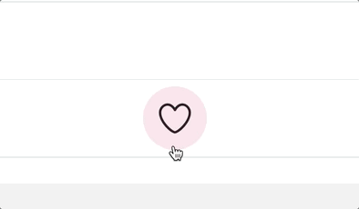

# Critter Project

This front-end focused project required creating a cat themed Twitter clone, "Critter".

Project functionality is achieved via a simulated RESTful API; to serve, retrive, add and alter data.

Created as part of the Full-Stack Web Development Diploma with <a href='https://concordiabootcamps.ca/' alt='link to Concordia Bootcamps website'>Concordia Bootcamps</a>.

---
## Screenshots

---
## Features
- Ability to write and post new meows
- Indicated character limitation on meows
- Full liking and retweeting functionality
- "Follow" and "Unfollow" functionality
- Functioning, interactive user pages
- Animated like button
- Follower listings
- Loading indications and Error Page

